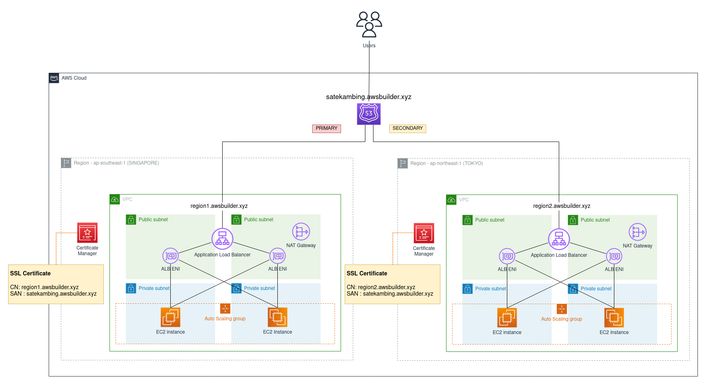

# Demo CDK for Web Application

This stack consist of :

1. VPC
2. Auto Scaling Group, to launch EC2 instances. 
3. EC2 User Data to install docker & run docker container web server on port 80.
4. Attach Auto Scaling Group to Target Group
5. Create Application Load Balancer with 2 listeners (HTTP & HTTPS)
6. Create SSL Certificate with SAN. SSL contains both the regional domain & the failover groupset domain.
7. Create 3 Hosted Zone:
    - region1.awsbuilder.xyz (as regional DNS record)
    - region2.awsbuilder.xyz (as regional DNS record)
    - satekambing.awsbuilder.xyz (as failover group set)

Below is the high level diagram for the stacks:



As prerequisite you must have CDK bootstrap in the first place, run the following command on each region:

```
cdk bootstrap aws://<AWS_ACCOUNT_ID>/<AWS_REGION>
```

Run the wrapper like this:

```
 bin/wrapper.sh --accountid 123456789012 \
    --region1 ap-southeast-1 \
    --region2 ap-northeast-1 \
    --region1role PRIMARY \
    --region2role SECONDARY \
    --keypair1 mykeysing \
    --keypair2 mykeytokyo \
    --cidr1 172.11.0.0/24 \
    --cidr2 172.13.0.0/24 \
    --subdomain1 region1 \
    --subdomain2 region2 \
    --basedomain mybaseurl.xyz \
    --failoversubdomain satekambing
```